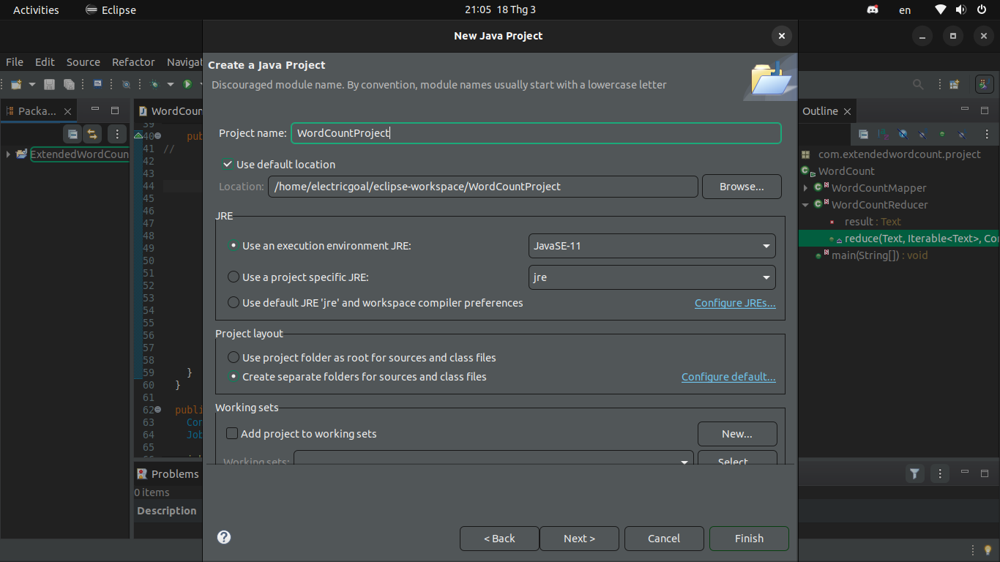
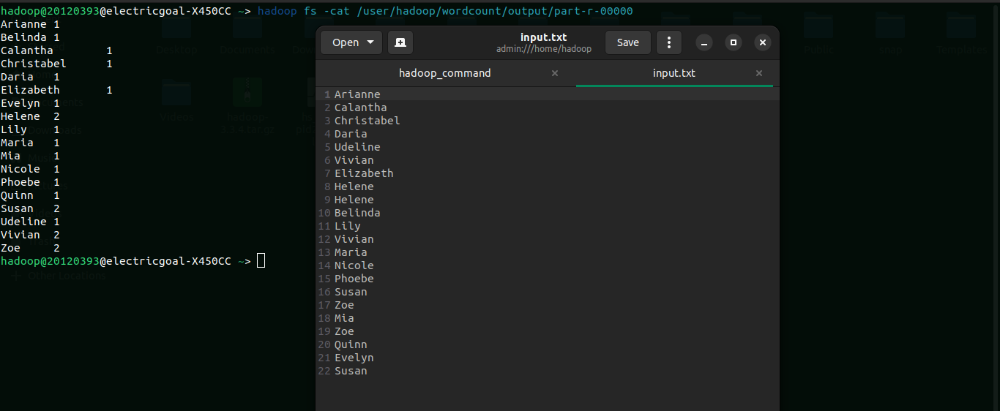

# Lab 01: A Gentle Introduction to Hadoop

## Setting up Single-node Hadoop Cluster

## Introduction to MapReduce
1. How do the input keys-values, the intermediate keys-values, and the output keys-values relate?

`Answer:` 
- Input keys-values: The input data is divided into splits and represented as key-value pairs. Each input key-value is read into the MapReduce job using a RecordReader, which is responsible for reading the input data and converting it into key-value pairs.
- Intermediate keys-values: The map function processes the input keys-values and generates intermediate key-value pairs. The intermediate keys and values may be different from the input keys-values, depending on how the map function processes the data. The intermediate key-value pairs are sorted and grouped by key before being passed to the reduce function.
- Output keys-values: The reduce function generates the final output keys-values based on the intermediate key-value pairs that are passed to it. The output keys-values may be different from the intermediate keys-values, depending on how the reduce function processes the data. The output keys-values are typically written to a distributed file system, such as HDFS, or to a database. The output of the MapReduce job can be used as input to other MapReduce jobs or as input to other applications.

2. How does MapReduce deal with node failures?

`Answer:`

Worker failure: The master node send heartbeat to each worker node. If a worker node fails, the master reschedule the tasks handled by the worker.

Master failure: The whole MapReduce job gets restarted through a different master based on checkpointed state of the failured master.

3. What is the meaning and implication of locality? What does it use?

`Answer:`

The concept of locality in the MapReduce refers to the idea that it is beneficial to process data on the same node where the data is stored, rather than moving it across the network to another node for processing. This is known as data locality.

MapReduce uses the concept of data locality to optimize the processing of data. The MapReduce framework is designed to distribute processing tasks to the nodes where the data is stored, in order to maximize data locality. When processing a large dataset, the framework splits the data into smaller chunks and distributes them across the cluster. Then, the Map tasks are scheduled on the same node where the data is stored, so that the data can be processed locally. Finally, the Reduce tasks are scheduled to aggregate the intermediate results generated by the Map tasks, again with the goal of minimizing data movement across the network.

4. Which problem is addressed by introducing a combiner function to the MapReduce model?

The problem that is addressed by introducing a combiner function is the excessive duplicate data transfer during the shuffling phase of the MapReduce job. Without a combiner function, all the intermediate key-value pairs generated by the map tasks are transferred over the network to the reduce tasks, resulting in high network traffic and increased processing time.

By introducing a combiner function, the amount of data that needs to be transferred over the network is reduced, resulting in faster processing times and reduced network traffic. The combiner function helps to group together intermediate key-value pairs with the same key and perform a local aggregation, reducing the number of key-value pairs that need to be transferred. This is particularly useful when the same intermediate key appears multiple times across the map outputs.

## Running a warm-up problem: Word Count

#### Use Eclipse IDE to run MapReduce on Ubuntu

`Step 0`: Install Eclipse on Ubuntu (if you had installed, please go to next step)

```
sudo snap install --classic eclipse
```

`Step 1`: Create new Java project

Open Eclipse, select **File** -> **New** -> **Java project**


Enter project name and click on **Next** button


Click on **Finish** Button


Result look like this


`Step 2`: Delete file *module-info.java*


`Step 3`: Create Java package

Right click on project name, select **New** -> **Package** 


Enter Package name and click **Finish**


`Step 4`: Create Java class

Right click on project name, select **New** -> **Class** to create a Java class


Enter Class name and click **Finish**


`Step 5`: Paste WordCount code to the *WordCount.java* file just created

**Note**: you should see many errors 


`Step 6`: Configure build path of the project

Right click on project name, select **New** -> **Build Path** -> **Configure Build Path**


Click on the **Libraries** tab


Select **Classpath** section and click on the **Add External JARs** button


Navigate to the Hadoop installation directory and select the following JAR files:

- hadoop-mapreduce-client-core-\<version>.jar
- hadoop-mapreduce-client-common-\<version>.jar
- hadoop-mapreduce-client-jobclient-\<version>.jar
- hadoop-common-\<version>.jar


Click on the button **Apply and Close**


After that, the errors should disappear


`Step 7`: Export to JAR file

Right click to project name, select **Export**. You should see this screen, click on **JAR file** -> **Next**


Enter name of jar file and path to save this jar file and. Once done, click on **Next** button


Click on **Next** button until see this screen and browse the the package in this project. Once done, click on **Finish** button


After all, you will get the Jar file


`Step 7`: Prepare to run MapReduce

Create new folder name "wordcount" in HDFS

```
hadoop fs -mkdir -p /<your-favorite-path>/worldcount
```
Create "input" folder in "wordcount" folder to store input file

```
hadoop fs -mkdir -p /<your-favorite-path>/wordcount/input
```
Put *input.txt* file into "input" directory
```
hadoop fs -put /<local_file_path>/input.txt /<your-favorite-path>/wordcount/input
```

Open browser an enter http://localhost:9870, you should see the screen like this


Click on **Utilities** tab -> **Browse the file system**


Browse to your "wordcount" directory, you should see "input" folder. Click on it you will see **input.txt** file


`Step 8`: Run MapReduce

```
hadoop jar WordCount.jar /<your-favorite-path>/wordcount/input/input.txt /<your-favorite-path>/wordcount/output

# In my case, <your-favorite-path> is user/hadoop
hadoop jar WordCount.jar /user/hadoop/wordcount/input/input.txt /user/hadoop/wordcount/output
```
You should see something like this


To see the result, enter this command

```
hadoop fs -cat /<your-favorite-path>/wordcount/output/part-r-00000

# In my case
hadoop fs -cat /user/hadoop/wordcount/output/part-r-00000
```
Compare to the input



## Bonus

Insert table example:

Server IP Address | Ports Open
------------------|----------------------------------------
192.168.1.1       | **TCP**: 21,22,25,80,443
192.168.1.2       | **TCP**: 22,55,90,8080,80
192.168.1.3       | **TCP**: 1433,3389\
**UDP**: 1434,161

Code example:

```python
print("Hello")
```

```bash
cat ~/.bashrc
```

Screenshot example:


\newpage

Screenshot example:


Reference examples:

Some text in which I cite an author.[^fn1]

More text. Another citation.[^fn2]

What is this? Yet _another_ citation?[^fn3]


## References
<!-- References without citing, this will be display as resources -->
- Three Cloudera version of WordCount problem:
    - https://docs.cloudera.com/documentation/other/tutorial/CDH5/topics-/ht_wordcount1.html
    - https://docs.cloudera.com/documentation/other/tutorial/CDH5/topics/ht_wordcount2.html
    - https://docs.cloudera.com/documentation/other/tutorial/CDH5/topics/ht_wordcount3.html
- Book: MapReduce Design Patterns [Donald Miner, Adam Shook, 2012]
- All of StackOverflow link related.

<!-- References with citing, this will be display as footnotes -->
[^fn1]: So Chris Krycho, "Not Exactly a Millennium," chriskrycho.com, July 2015, http://v4.chriskrycho.com/2015/not-exactly-a-millennium.html
(accessed July 25, 2015)

[^fn2]: Contra Krycho, 15, who has everything _quite_ wrong.

[^fn3]: ibid